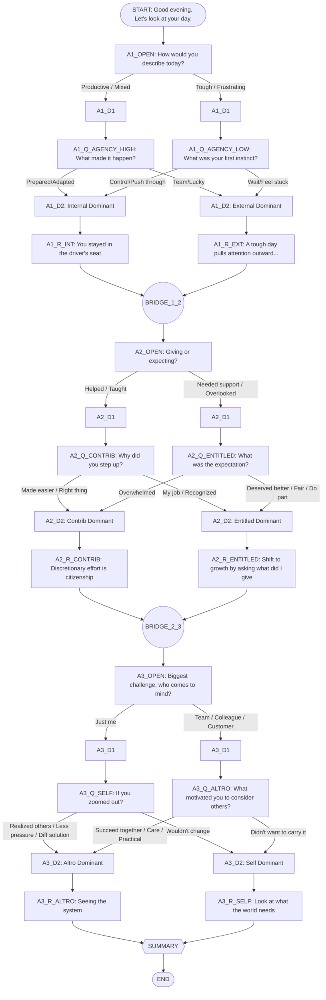

# Daily Reflection Tree Diagram

```mermaid
graph TD
    %% Start
    START([START: Good evening. Let's look at your day.]) --> A1_OPEN

    %% Axis 1: Locus (Victim vs Victor)
    A1_OPEN[A1_OPEN: How would you describe today?]
    A1_OPEN -- Productive / Mixed --> A1_D1_HIGH[A1_D1]
    A1_OPEN -- Tough / Frustrating --> A1_D1_LOW[A1_D1]

    A1_D1_HIGH --> A1_Q_AGENCY_HIGH[A1_Q_AGENCY_HIGH: What made it happen?]
    A1_D1_LOW --> A1_Q_AGENCY_LOW[A1_Q_AGENCY_LOW: What was your first instinct?]

    A1_Q_AGENCY_HIGH -- Prepared/Adapted --> A1_D2_INT[A1_D2: Internal Dominant]
    A1_Q_AGENCY_HIGH -- Team/Lucky --> A1_D2_EXT[A1_D2: External Dominant]
    
    A1_Q_AGENCY_LOW -- Control/Push through --> A1_D2_INT
    A1_Q_AGENCY_LOW -- Wait/Feel stuck --> A1_D2_EXT

    A1_D2_INT --> A1_R_INT[A1_R_INT: You stayed in the driver's seat]
    A1_D2_EXT --> A1_R_EXT[A1_R_EXT: A tough day pulls attention outward...]

    %% Bridge to Axis 2
    A1_R_INT --> BRIDGE_1_2((BRIDGE_1_2))
    A1_R_EXT --> BRIDGE_1_2((BRIDGE_1_2))

    %% Axis 2: Orientation (Contribution vs Entitlement)
    BRIDGE_1_2 --> A2_OPEN[A2_OPEN: Giving or expecting?]
    
    A2_OPEN -- Helped / Taught --> A2_D1_CONTRIB[A2_D1]
    A2_OPEN -- Needed support / Overlooked --> A2_D1_ENTITLED[A2_D1]

    A2_D1_CONTRIB --> A2_Q_CONTRIB[A2_Q_CONTRIB: Why did you step up?]
    A2_D1_ENTITLED --> A2_Q_ENTITLED[A2_Q_ENTITLED: What was the expectation?]

    A2_Q_CONTRIB -- Made easier / Right thing --> A2_D2_CONTRIB[A2_D2: Contrib Dominant]
    A2_Q_CONTRIB -- My job / Recognized --> A2_D2_ENTITLED[A2_D2: Entitled Dominant]

    A2_Q_ENTITLED -- Overwhelmed --> A2_D2_CONTRIB
    A2_Q_ENTITLED -- Deserved better / Fair / Do part --> A2_D2_ENTITLED

    A2_D2_CONTRIB --> A2_R_CONTRIB[A2_R_CONTRIB: Discretionary effort is citizenship]
    A2_D2_ENTITLED --> A2_R_ENTITLED[A2_R_ENTITLED: Shift to growth by asking what did I give]

    %% Bridge to Axis 3
    A2_R_CONTRIB --> BRIDGE_2_3((BRIDGE_2_3))
    A2_R_ENTITLED --> BRIDGE_2_3((BRIDGE_2_3))

    %% Axis 3: Radius (Self vs Altro)
    BRIDGE_2_3 --> A3_OPEN[A3_OPEN: Biggest challenge, who comes to mind?]

    A3_OPEN -- Just me --> A3_D1_SELF[A3_D1]
    A3_OPEN -- Team / Colleague / Customer --> A3_D1_ALTRO[A3_D1]

    A3_D1_SELF --> A3_Q_SELF[A3_Q_SELF: If you zoomed out?]
    A3_D1_ALTRO --> A3_Q_ALTRO[A3_Q_ALTRO: What motivated you to consider others?]

    A3_Q_SELF -- Realized others / Less pressure / Diff solution --> A3_D2_ALTRO[A3_D2: Altro Dominant]
    A3_Q_SELF -- Wouldn't change --> A3_D2_SELF[A3_D2: Self Dominant]

    A3_Q_ALTRO -- Succeed together / Care / Practical --> A3_D2_ALTRO
    A3_Q_ALTRO -- Didn't want to carry it --> A3_D2_SELF

    A3_D2_ALTRO --> A3_R_ALTRO[A3_R_ALTRO: Seeing the system]
    A3_D2_SELF --> A3_R_SELF[A3_R_SELF: Look at what the world needs]

    %% Summary and End
    A3_R_ALTRO --> SUMMARY{{SUMMARY}}
    A3_R_SELF --> SUMMARY{{SUMMARY}}
    SUMMARY --> END([END])
```
